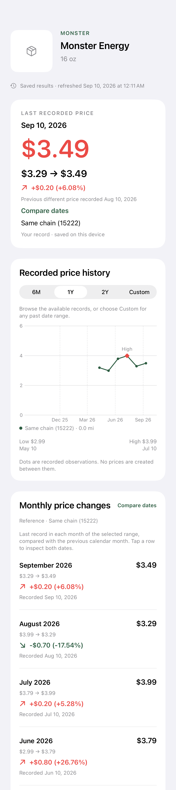
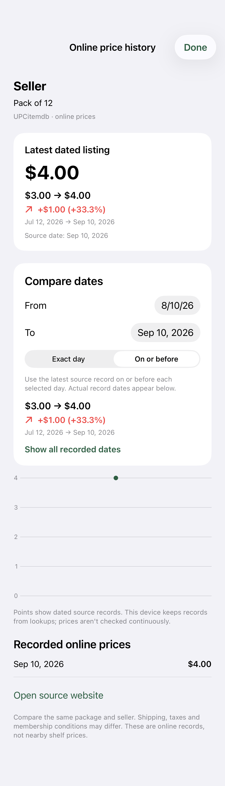

# ShelfLedger

[](https://github.com/Exaaiser/ShelfLedger/actions/workflows/ios.yml)

A native iOS app for looking up grocery prices and comparing how they change over time. Scan a barcode, browse dated store observations and online listings, or record a shelf price yourself.

Built with **SwiftUI, Swift Charts, SwiftData and async/await**. No account or API key is needed to run it.

<p>
  
  
</p>

*Screenshots use synthetic test data to demonstrate the interface. They are not current retailer prices.*

## What it does

- **Scan or search.** Read product barcodes with the camera, enter a barcode manually, or search by name.
- **Compare dates.** Inspect the previous price change, monthly records, or a custom date range. Choose an exact day or the last observation on or before that day. Increases appear in red; decreases in green.
- **Expand the search area.** Start with observations within 25 km. If none are found, look for records in the same city, then the country. Wider-area records are labeled.
- **Track online listings.** Browse seller offers without selecting a location. Dated prices are retained between lookups, with history kept separate for each seller, listing and package.
- **Record a price.** Save the price, store and date of something you saw. Personal observations stay on the device.
- **Keep useful results offline.** Saved observations remain available when a provider fails. Missing data and partial responses are shown explicitly.

## Run locally

Requires **Xcode 16 or later** and an **iOS 17+** simulator or device.

```sh
git clone https://github.com/Exaaiser/ShelfLedger.git
cd ShelfLedger
open ShelfLedger.xcodeproj
```

Select the **ShelfLedger** scheme and an iPhone simulator, then run. For a physical device, choose your own development team and a unique bundle identifier under **Signing & Capabilities**. Camera scanning requires a device; manual barcode entry works in the simulator.

Location is optional. You can browse online prices immediately, enter a US ZIP code, or grant location access to find nearby stores.

The Xcode project is checked in. To regenerate it after changing `project.yml`, install [XcodeGen](https://github.com/yonaskolb/XcodeGen) and run:

```sh
xcodegen generate
```

Regeneration replaces project-level signing edits, so keep personal settings out of `project.yml` before committing.

## Architecture

```text
Application/     App entry point, navigation and dependency composition
Presentation/    SwiftUI screens and observable view models
Domain/          Value types, repository interfaces and price analysis
Data/            API adapters, repository coordination and SwiftData storage
Core/            HTTP transport, location services and session state
Tests/           Domain, provider, persistence and rendering tests
UITests/         Onboarding, scanner validation and search navigation
```

Dependencies are injected at the app boundary. Provider protocols keep networking replaceable in tests, while the repository coordinates concurrent lookups, cache fallback and personal records. Price comparisons live in domain use cases rather than view code.

## Data sources

| Source | Used for |
| --- | --- |
| [Open Food Facts](https://world.openfoodfacts.org/) | Product identity, images and search |
| [Open Prices](https://prices.openfoodfacts.org/api/docs) | Dated physical-store and online observations |
| [UPCitemdb](https://www.upcitemdb.com/api/) | Product lookup and online seller listings |
| [OpenStreetMap](https://www.openstreetmap.org/copyright) | Nearby store locations through Overpass |
| [Zippopotam.us](https://www.zippopotam.us/) | US ZIP-code lookup |

These are third-party services with their own availability, coverage and usage limits. Open Food Facts and Open Prices data are provided under ODbL; product images have separate attribution requirements. Source credits are also available in the app. Repository screenshots use test fixtures rather than downloaded product images.

## Scope and limitations

ShelfLedger tracks individual product prices; it does not calculate an official inflation index. The current implementation focuses on **USD prices and US ZIP codes**.

Crowdsourced coverage is uneven. A valid barcode may have product information and online offers but no historical store records. Online history accumulates when products are opened or refreshed; there is no background polling, cloud sync or notification service. A recorded price does not confirm today's stock, shipping, tax or membership terms.

No personal database, device cache, credentials or signing profile is included in this repository. Tests include synthetic observations and one small public API response used to validate decoding.

## Tests

The suite covers barcode validation, date matching, price-change calculations, geographic fallback, partial provider failures, persistent online history, stale-search cancellation and basic UI navigation. Network behavior is tested with injected responses, so the suite does not depend on live API coverage.

```sh
xcodebuild -list -project ShelfLedger.xcodeproj
xcrun simctl list devices available

# Replace SIMULATOR_UUID with an available iPhone simulator UUID.
xcodebuild test \
  -project ShelfLedger.xcodeproj \
  -scheme ShelfLedger \
  -destination 'platform=iOS Simulator,id=SIMULATOR_UUID' \
  CODE_SIGNING_ALLOWED=NO
```

GitHub Actions builds the app and runs the unit and UI tests on a macOS runner. Rendering tests attach screenshots to the test-result bundle for visual review.
